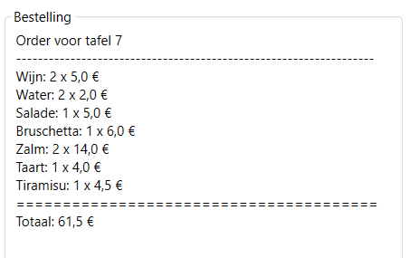
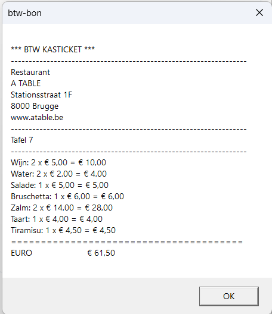
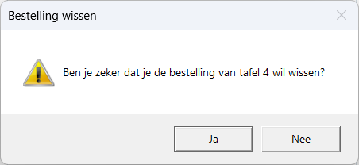
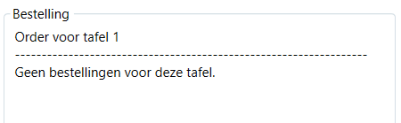

# PE02: Orderapp restaurant

## 1. Opdrachtomschrijving
Maak voor de restaurant 'A TABLE' een WPF-applicatie die het de obers gemakkelijk maakt om orders van de gasten op te nemen en om het kassaticket aan te maken.  
Er zijn 8 tafels in het restaurant.  
Er worden drankjes, voorgerechten, hoofdgerechten en desserts aangeboden aan de gasten.
Voorzie in de applicatie onderstaand aanbod.  

**Dranken:**  
- Water: 2 euro
- Cola: 2.5 euro
- Wijn: 5 euro
- Bier: 3 euro

**Voorgerechten:** 
- Soep: 4.5 euro
- Salade: 5 euro
- Bruschetta: 6 euro

**Hoofdgerechten:**  
- Steak: 15 euro
- Kipfilet: 12 euro
- Zalm:  14 euro

**Desserts:**
- Ijs: 3.5 euro
- Taart: 4 euro
- Tiramisu: 4.5 euro

Telkens wanneer de gasten iets bestellen, kan de ober dit via de orderapp bijhouden.  
1. Hij/zij kiest de juiste tafel door op de juiste tafelknop te klikken.  
2. Vervolgens kan het gekozen artikel aan de bestelbon worden toegevoegd.
3. Het is mogelijk om fouten te corrigeren (bijv. wanneer het verkeerde artikel aan de bestelbon werd toegevoegd, of het aantal van een besteld artikel niet klopt)
4. De bestelbon van elke tafel wordt in het geheugen bewaard. De ober kan dus zonder probleem bestellingen van meerdere tafels opnemen...
5. Wanneer de gasten wensen af te rekenen, kan de ober het kassaticket afdrukken. 
6. Hij/zij kan ook een tafelorder wissen.

## 2. De applicatie
### Bij het opstarten
Wanneer de applicatie laadt, zijn alleen de 8 knoppen voor de tafelkeuze ingeschakeld.

Als de ober op een tafelknop klikt: 
- wijzigt de aangeklikte tafelknop van kleur
- worden de knoppen  ``Drank``, ``Voorgerecht``, ``Hoofdgerecht`` en ``Dessert`` ingeschakeld
- blijft de combobox met de artikelen uitgeschakeld zolang de ober geen productcategorie aanklikt
- verschijnt het order van de gekozen tafel bij ``Bestelling``. 

### Bestelling opnemen
- De ober kiest de juiste tafel door op een van de 8 tafelknoppen te klikken
- Vervolgens kiest hij/zij een artikelcategorie door op een van de knoppen ``Drank``, ``Voorgerecht``, ``Hoofdgerecht`` of ``Dessert`` te klikken
- Vervolgens kiest hij/zij het gewenste artikel in de combobox
- Het gekozen artikel aan de bestelbon toevoegen kan door (een of meerdere keren) op de ``+`` te klikken. 
- Het gekozen artikel van de bestelbon verwijderen kan door (een of meerdere keren) op de ``-`` te klikken. Zorg er voor dat de het artikel helemaal van de bestelbon verdwijnt als het aantal 0 wordt.

De bestelbon is steeds up-to-date en:
 - toont het juiste tafelnummer
 - toont het overzicht van alle bestelde artikels met de juiste hoeveelheid en de juiste eenheidsprijs
 - toont het totale bedrag van de bestelbon

Bij het veranderen van tafel worden de juiste bestelbongegevens getoond bij ``Bestelling``.  
Er is steeds de mogelijkheid om de bestelling van de gekozen tafel aan te vullen of aan te passen. 

### Kassaticket maken
Voor deze testapplicatie dien je uiteraard geen printer aan te sturen. Het kassaticket verschijnt op het scherm in een MessageBox.  
  

### Een tafelbestelling leegmaken
De ober kan de bestelling van een tafel wissen.

## 3. Extra's
Extra's kan je pas scoren als de basis van je oefening volledig werkend is.  

### Bevestiging bij het wissen van de bestelbon (💪💪💪)
Zorg er voor dat er bij het klikken op de knop ``Leeg Tafel Bestelling`` een dialoogvenster verschijnt die  een bevestiging vraagt. De ober kan dus nog steeds het wissen van de bestelbon annuleren.  

### Geen bestelling voor de gekozen tafel (💪)
Indien er geen bestelling is voor een gekozen tafel, wordt dit ook duidelijk zo vermeld bij ``Bestelling``.  

### Geen artikelen op de bestelbon = onmogelijk om de bestelbon te legen of om het kassaticket af te drukken (💪💪)
Indien er geen artikel op de bestelbon staan, mag het niet mogelijk zijn om op de knoppen ``Leeg Tafel Bestelling`` of ``Maak Kassaticket``te klikken. De knoppen moet dan ook uitgeschakeld zijn.  

### Default categorie is 'DRANK' en default product is 'Water' (💪)
Telkens de ober een andere tafel kiest, is de categorie 'Drank' geslecteerd. De knop ``Drank`` wordt dus blauw, de overige terug grijs. De combobox met de artikelen bevat de dranken en de optie 'Water' is reeds geselecteerd.

### Corrigeren van een bestelling (💪💪💪)
Zorg ervoor dat de knop ``-`` uitgeschakeld is als het gekozen artikel niet op de bestelling voorkomt.

## 4. Demo

